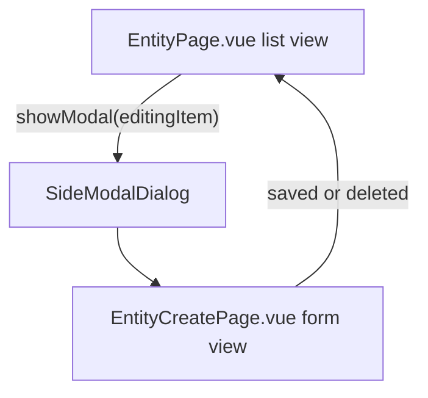

# Agent Memo: New CRUD Module

Quick start: if you need a copy-paste launch prompt, use `front/docs/AGENT_ONE_SHOT_PROMPT.md`.

## Goal

This memo is a practical blueprint for creating a new module in the project using existing visual, DTO, and backend patterns.

Reference pages:
- `front/src/views/pages/clients/ClientsPage.vue`
- `front/src/views/pages/clients/ClientCreatePage.vue`
- `front/src/views/pages/orders/OrdersPage.vue`
- `front/src/views/pages/orders/OrderCreatePage.vue`

## Complexity baseline

| Level | List page | Create/edit page | When to use |
|---|---|---|---|
| Basic | `ClientsPage.vue` | `ClientCreatePage.vue` | Standard directory module: table + cards, one side modal, optional timeline |
| Advanced | `OrdersPage.vue` | `OrderCreatePage.vue` | Need kanban, nested side modals, payment flows, advanced batch actions |

Important: there is no standalone `SideModalCreate` component. The project pattern is `SideModalDialog` + `EntityCreatePage`.

## Page roles

- `*Page.vue`: listing, filters, view mode, batch actions, export, modal open/close, route sync.
- `*CreatePage.vue`: form fields, validation payload, save/delete, close confirmation, emit events.

## Frontend list page blueprint (`*Page.vue`)

### Required components

- `CardListViewShell`
- `DraggableTable`
- `TableControlsBar`
- `TableFilterButton`
- `PrimaryButton`
- `ViewModeToggle`
- `BatchButton` (if selection actions are needed)
- `SideModalDialog`
- `AlertDialog`
- `TableSkeleton` and `CardsSkeleton`
- `MapperCardGrid` (if cards mode is enabled)
- Domain filter component (`*Filters.vue`)

### Recommended mixins (basic module)

| Mixin | Responsibility |
|---|---|
| `crudEventMixin` | list state, pagination, fetch, save/delete handlers |
| `modalMixin` | side modal state, route item open/close |
| `listQueryMixin` | search and filters application |
| `companyChangeMixin` | reset filters and refetch on company change |
| `notificationMixin` | success and error notifications |
| `getApiErrorMessageMixin` | normalized API error message extraction |
| `batchActionsMixin` | batch delete and selected ids |
| `exportTableMixin` | export flow and loading state |
| `createStoreViewModeMixin` | table/cards or table/kanban/cards store-driven view mode |
| `timelineSideModalMixin` + `timelineUnreadMixin` | timeline side panel behavior (when timeline exists) |

### Required `data()` contract

- `controller`
- `cacheInvalidationType`
- `deletePermission`
- `itemViewRouteName`
- `baseRouteName`
- localized success/error texts
- `table-key` for `DraggableTable` column persistence
- `cardFieldsKey` for card field visibility persistence

### List behavior contract

- Use `$store.getters.hasPermission(...)` on create/delete/export controls and protected cells/actions.
- Keep global search integration via `listQueryMixin` and event bus pattern.
- Keep `itemMapper` and `cardMapper` formatting through DTO methods, not ad-hoc template formatting.
- Keep one side modal for the main create/edit form; add extra modals only for real advanced flows.

## Frontend create/edit page blueprint (`*CreatePage.vue`)

### Layout contract

- Root container: `flex h-full min-h-0 flex-col`
- Scrollable content: `app-form-scroll-container`
- Tabs with `TabBar` if form has sections
- Footer actions via teleport: `sideModalFooterPortal`

### Required mixins

- `crudFormMixin`
- `sideModalFooterPortal`

Optional by domain:
- `phoneEmailListFormMixin`
- `storeDataLoaderMixin`
- `dateFormMixin`
- `projectSelectionMixin`
- `clientBalanceCashMixin`

### Required methods and emits

- `prepareSave()`
- `performSave()`
- `performDelete()`
- emits: `saved`, `saved-error`, `deleted`, `deleted-error`, `close-request`, `editing-item-update`

### Form behavior contract

- Keep payload assembly in `prepareSave`.
- Keep persistence calls in `performSave` and `performDelete`.
- Respect close-confirm behavior from `crudFormMixin`; do not bypass dirty-state checks.
- Keep save button permissions aligned with entity create/update permissions.

## DTO and API controller contract

### DTO (`front/src/dto/{entity}/{Entity}Dto.js`)

- Provide `fromApi` and `fromApiArray`.
- Keep normalization and lightweight display helpers in DTO.
- Use DTO methods in `itemMapper` and card rendering.

### API controller (`front/src/api/{Entity}Controller.js`)

- Extend `BaseController`.
- Keep list endpoint returning `PaginatedResponse` with DTO array.
- Keep API errors normalized via existing request wrappers.

## Backend mirror contract (based on Client module)

Reference:
- `back/app/Http/Controllers/Api/ClientController.php`

| Layer | Pattern |
|---|---|
| Controller | `extends BaseController`, repository via constructor, thin orchestration only |
| Repository | list with pagination + create/update/delete methods, cache invalidation in existing style |
| Resource | response mapping for list/cards/views, no heavy business logic |
| Form Requests | all validation in request classes, controller consumes validated data |
| Policy/Permissions | `entity_create`, `entity_update`, `entity_delete`, `entity_export`, etc. |
| Routes | resource-like registration in API routes, aligned with existing modules |

## New module checklist

- `front/src/views/pages/{entity}/{Entity}Page.vue`
- `front/src/views/pages/{entity}/{Entity}CreatePage.vue`
- `front/src/views/components/app/{Entity}Filters.vue` or domain components folder equivalent
- `front/src/api/{Entity}Controller.js`
- `front/src/dto/{entity}/{Entity}Dto.js`
- Router entries for list and optional `EntityView/:id`
- Store view mode getter/dispatch if view mode is persisted
- i18n keys in `lang/*.js`
- Backend: controller, repository methods, resource, request classes, policies, routes

## Orders-specific features (apply only if required)

Do not copy these into simple modules unless requirements explicitly need them:
- `ordersViewModeMixin` with kanban mode
- `kanbanByStatusMixin` and `KanbanBoard`
- multiple `SideModalDialog` instances (invoice/transaction flows)
- status update flows with payment prerequisites
- nested level side modal forms
- lazy-loaded heavy tabs for performance

## Implementation rules for agents

- Reuse existing components, mixins, DTO patterns, and backend contracts first.
- Keep DRY: one source of truth for each business rule.
- Do not introduce fallback branches to hide data/contract issues.
- Fix root causes instead of adding silent recovery behavior.
- Avoid redundant type checks where contracts/DTO/validation already guarantee shape.
- Make minimal, targeted changes without unsolicited refactors.

## Prompt template for agent run

Use this prompt when asking an agent to create a new module:

Create module `{Entity}` using `front/docs/AGENT_NEW_CRUD_MODULE.md` and `front/docs/UI_CSS_CLASSES.md`.  
Use `ClientsPage + ClientCreatePage` as the default baseline.  
Use `OrdersPage + OrderCreatePage` patterns only if kanban, nested side modals, or payment workflow is explicitly required.  
Follow project rules in `.cursorrules` and do not invent a new page architecture.
