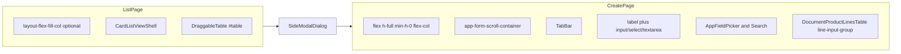

# UI CSS Classes Memo

## Purpose

This memo documents reusable CSS classes and when to apply them when building new modules.

Sources:
- `front/src/assets/app.css`
- `front/src/assets/document-product-lines-table.css`
- `front/src/views/components/app/forms/AppFieldPicker.vue`
- `front/src/views/components/app/forms/DocumentProductLinesTable.vue`
- `front/src/views/pages/clients/ClientCreatePage.vue`
- `front/src/views/pages/orders/OrderCreatePage.vue`

## Global form styles

Use global form styles from `app.css` for regular create/edit forms:
- `label`, `label.required`
- `input`, `select`, `textarea` (default and focus states)
- disabled form control states

Use these defaults first. Do not create local duplicates for the same behavior.

## Form layout in side modal

| Class | Where to use |
|---|---|
| `flex h-full min-h-0 flex-col` | Root container of `*CreatePage.vue` inside `SideModalDialog` |
| `app-form-scroll-container` | Scrollable form area with `TabBar` and fields |
| `layout-flex-fill-col` | Root layout for list pages that need full-height column behavior (for example with kanban) |

## App field picker classes

The `app-field-picker__*` classes are internal structure classes for `AppFieldPicker`.

Use only inside:
- `AppFieldPicker.vue`
- Search components built on it (`ClientSearch`, `ProductSearch`, `CategorySearch`, `UserSearch`, similar)

Do not copy `app-field-picker__*` markup manually into page templates.

## Product lines input group classes

These classes are used in product/document line tables:

| Class or modifier | Use case |
|---|---|
| `line-input-group` | Base wrapper for numeric/text field with suffix/unit/currency |
| `line-input-group--locked` | Read-only visual state for locked line input |
| `line-input-group--with-unit` | When unit selector or unit label is present |
| `line-input-group--with-suffix` | When a suffix element is present |
| `line-input-group--with-hint` | When hint/help text is present |
| `line-input-group__field` | Inner editable field element |
| `line-input-group__currency` | Currency suffix label |
| `line-input-group__unit` | Unit label container |
| `line-input-group__unit--select` | Unit `<select>` variant |
| `product-search-table-wrap` | Scroll wrapper around product table |
| `product-search-row` | Product table row base state |
| `product-search-table__name-col` | Sticky product name column |

## List table selectors

`DraggableTable` uses internal table selectors:
- `#table`
- `#header-row`
- `#table-body`
- `#table-skeleton`

Do not assign these IDs on arbitrary custom containers.

## Other shared utility classes

| Class or group | Purpose |
|---|---|
| `search-highlight-mark` | Highlight matched search fragments |
| `fade`, `fade-in` | Shared transitions in list and modal flows |
| `filters-modal-*` | Mobile filters enter/leave transitions |
| Theme vars (`--label-accent`, `--input-border`, `--input-bg`) | Light/dark compatible accents and input colors |

## What to avoid

- Do not replace global field styles with one-off inline Tailwind if global styles already cover the case.
- Do not duplicate existing BEM-like structures from components (`app-field-picker__*`) outside their component.
- Do not add new form/table classes before checking existing classes in both `app.css` and `document-product-lines-table.css`.
- Do not add fallback CSS branches to mask structural issues; align markup with existing component contracts.

## Visual mapping

